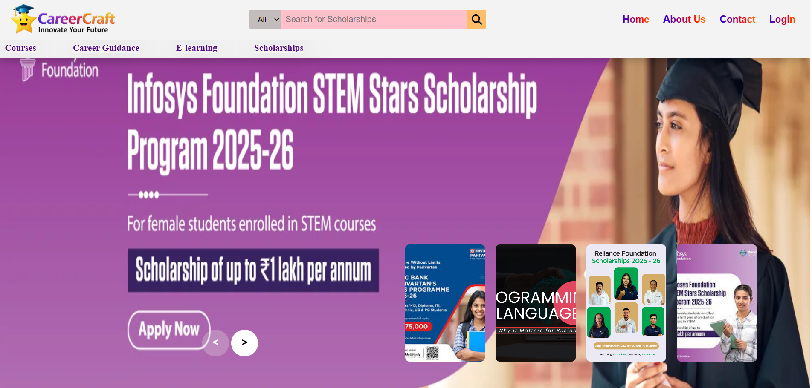
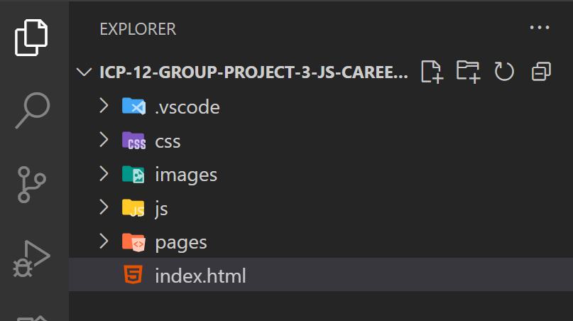

# 🚀 CareerCraft – Scholarships & E-Learning Platform  

 ## 👉 Live Website: 
(https://icp12careercraft.netlify.app/)

CareerCraft is a web platform designed to empower students with access to **scholarships** and an **e-learning system**. It helps learners secure financial aid while improving their skills through interactive courses, video lectures, and quizzes.  

---
### 🏠 Homepage  

## ✨ Features  

### 🏫 Scholarship Module  
- 🔍 Search & filter scholarships by eligibility, category, and deadlines  
- 📝 Student registration & login  
- 📂 Profile management with document uploads  
- 📅 notifications & alerts  

### 📚 E-Learning Module  
- 📖 Browse a variety of online courses  
- 🎥 Video lessons, tutorials, and reading materials  
- 📝 Quizzes, assignments & assessments   
- 📱 Mobile-friendly responsive design  
---

## 🛠️ Tech Stack  
- **Frontend:** HTML, CSS, JavaScript  
- **Version Control:** Git & GitHub  

---

## 📂 Project Structure  

## 🔗 Deployment
Can be deployed on
- GitHub Pages
- Netlify

## ⚙️ How to Run This Website  

### ▶️ Run Locally
1️⃣ **Clone or download the repository**
https://github.com/pratiksha950/icp12-group-project-3-js-github-CareerCraft

2️⃣ **Open index.html in your browser.**

## Contributors
